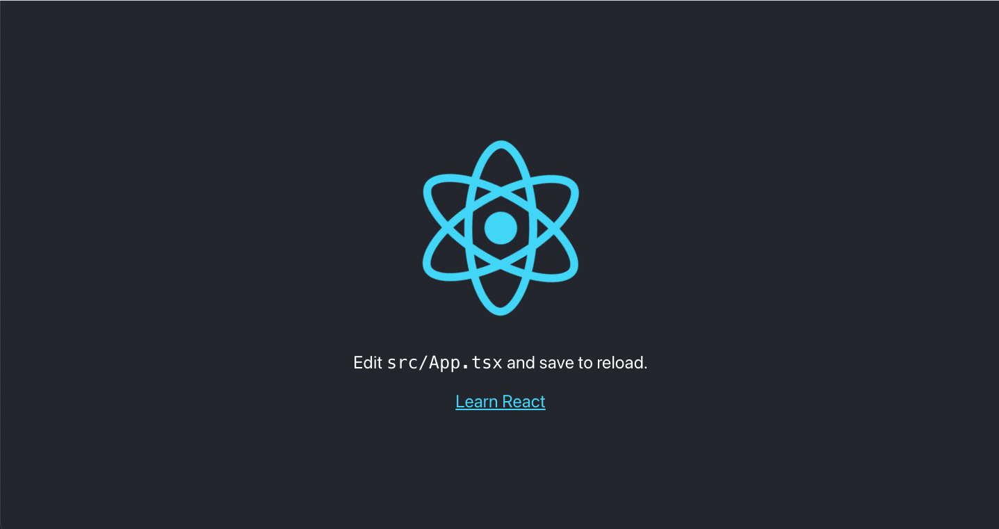

# サンプルプログラムの実行

## サンプルプログラムについて
以下のリポジトリが勉強会に使うサンプルプログラムとなります。
毎週の内容をこちらに適宜追加して行きます。
https://github.com/sekiyan372/react-study-sample

## 実行手順
サンプルプログラムは `Node.js`、 `yarn`、 `Git` の環境構築が完了すると動作するようになっています。
これらがまだ済んでいない人はそちらを完了してから実行をしてください。

Windowsではコマンドプロンプトなど、Macではターミナルなどで以下のコマンドを実行してください。
```bash
# 1.コードを保存したい場所に移動
$ cd [保存したい場所]

# 2.cloneコマンドでリモートから持ってくる
$ git clone https://github.com/sekiyan372/react-study-sample.git

# 3.cloneしたサンプルのディレクトリに移動
$ cd react-study-sample

# 4.パッケージのインストール
$ yarn install

# 5.プログラムの実行
$ yarn start
```

以上の手順で実行すると、自動的にブラウザが起動して以下のようなReactのアイコンが回転している画面が表示されると思います！この画面が表示されれば環境構築は完了です！！



※もしブラウザが自動で開かない時は http://localhost:3000/ にアクセスしてください。
