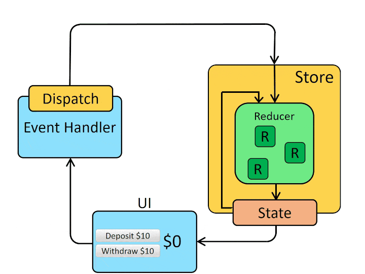

# 状態管理の拡張
ここは技術の紹介までとします。

## グローバルな State 管理
コンポーネントを

## Context での State 管理

## useContext

## useReducer

## その他の状態管理ライブラリ

### Redux

[Redux 公式](https://redux.js.org/)

Redux は2015年から存在している状態管理ライブラリで、今まで最も使用されてきた状態管理の手法でもあり、多くのプロジェクトで採用されてきています。Redux は Meta (旧Facebook) 社が提唱している単一方向にしかデータが流れないようにする `Flux アーキテクチャ` というものに則って設計されています。

### Recoil

[Recoil 公式](https://recoiljs.org/)

Recoli は React を開発している Meta (旧Facebook) 社が開発している状態管理ライブラリです。まだ2020年5月にリリースされたばかりで実用例は少ないですが、React と同じ会社が開発しているということで注目されている状態管理ライブラリです。

### Apollo Client

[Apollo Client 公式ドキュメント](https://www.apollographql.com/docs/)

Apollo Client は GraphQL API をクライアント側で使用するためのライブラリです。バックエンドとのやり取りに GraphQL を採用している場合は状態管理にこの Apollo Client を使用することも選択肢となってきます。
