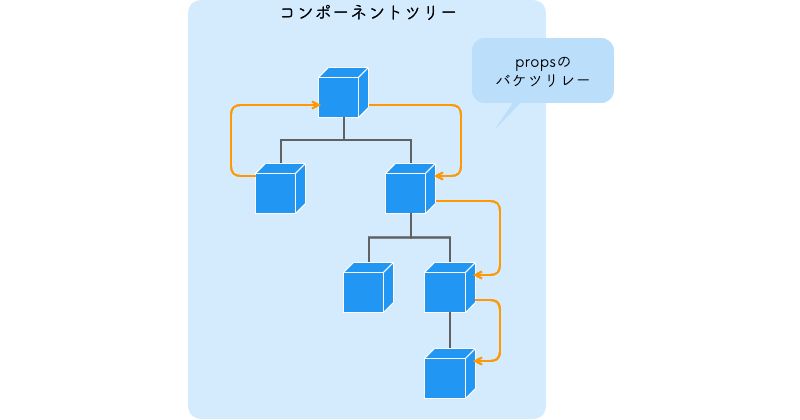

# 状態管理の拡張

ここは技術の紹介までとします。

## グローバルな State 管理

React ではコンポーネントを切り分けていった結果コンポーネントの構造が複数の階層構想になっていきます。そのような時に State を子コンポーネントで参照するとなった時は Props で渡していくことになるのですが、ことの時に `Props のバケツリレー` と呼ばれるものが発生します。これは階層が深ければ深いほど、離れたコンポーネント同士で State を共有することが面倒になってくることもあり、非常に扱いにくくなってしまいます。



Props のバケツリレーには以下のような弊害が生まれやすいです。

- コードが複雑化する
- リレーのためだけの Props が必要になるため、再利用できないコンポーネントになる
- State 変更時にリレーしている全てのコンポーネントが再レンダリングされる

このような時に使うのが `グローバルな State` です。グローバルな State 管理の仕組みを用いて、どこからでもアクセスできる State を作ることでコンポーネント間で Props を受け渡すことなく値の共有をすることができるようになります。

### Context での State 管理

React でグローバルな状態管理の方法はいくつかあるのですが、React 自体が持っている Context という機能を使っても実現ができます。

Context でのグローバルな State 管理は基本的に以下の 3 ステップが必要です。

1. `createContext` で Context の器を作る
2. 作成した Context の `Provider` でグローバルな State を扱いたいコンポーネントを囲む
3. State を参照したいコンポーネントで `useContext` を使う

Provider がグローバルな State を提供しており、各コンポーネントから useContext という Hooks を用いてグローバルな State を参照するような形になります。

具体的な使い方を知りたい人は、以下の記事に丁寧に説明されているので参考にしてみてください。

[React でデータを扱う概念の 1 つである Context API を使う方法について説明します。](https://dev-yakuza.posstree.com/react/context-api/)

### useReducer

`useReducer` は React Hooks の一種で、useState と似たような機能を持ちます。ですが、実は useState は useReducer に内部実装されているため `useReducer ⊃ useState` のような関係となっています。

useState との違いは Hooks の引数で初期値に加えて `(state, action) => newState` という型の reducer を受け取り、state と それを操作する `dispatch` を返します。

```typescript
const [state, dispatch] = useReducer(reducer, "初期値");
```

reducer は処理の塊のようなもので、State に対してどのような Action (処理) をするのかを決定するような役割です。つまり、useReducer はより複雑な機能を持たせられる useState だという考え方もできます。

useState と use Reducer の比較は以下のようになっています。

|                           | useState                           | useReducer                             |
| ------------------------- | ---------------------------------- | -------------------------------------- |
| 扱える state の type      | 数値、文字列、オブジェクト、論理値 | オブジェクト、配列                     |
| 関連する state の取り扱い | ×                                  | 複数を同時に取り扱うことが出来る       |
| ローカル or グローバル    | ローカル                           | グローバル useContext と一緒に取り扱う |

useReducer はグローバルな State 管理をするときに useContext と一緒に使うのが一般的となっています。

もちろん単体で使うこともあるので、以下の記事を読めばどのような時にそれぞれ使う必要があるのかがわかると思います。

[useContext + useReducer の使いどころ](https://panda-program.com/posts/react-usecontext-usereducer)

## その他の状態管理ライブラリ

### Redux

[Redux 公式](https://redux.js.org/)

Redux は 2015 年から存在している状態管理ライブラリで、今まで最も使用されてきた状態管理の手法でもあり、多くのプロジェクトで採用されてきています。Redux は Meta (旧 Facebook) 社が提唱している単一方向にしかデータが流れないようにする `Flux アーキテクチャ` というものに則って設計されています。


### Recoil

[Recoil 公式](https://recoiljs.org/)

Recoli は React を開発している Meta (旧 Facebook) 社が開発している状態管理ライブラリです。まだ 2020 年 5 月にリリースされたばかりで実用例は少ないですが、React と同じ会社が開発しているということで注目されている状態管理ライブラリです。

### Apollo Client

[Apollo Client 公式ドキュメント](https://www.apollographql.com/docs/)

Apollo Client は GraphQL API をクライアント側で使用するためのライブラリです。バックエンドとのやり取りに GraphQL を採用している場合は状態管理にこの Apollo Client を使用することも選択肢となってきます。
