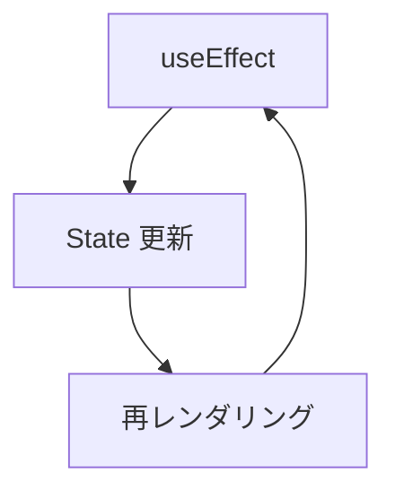

# useEffect を使ったサンプルプログラム

## カウンター

[サンプルプログラム](https://github.com/sekiyan372/react-study-sample/blob/main/src/pages/week4/Count.tsx)

このアプリケーションでは、カウンターを使って基本的な useEffect の動きを知ることができるようになっています。

このアプリケーションを通して、説明した useEffect が実際に正しく動作するのかを確認してください。

ここで用意されている count はカウンターの State です。

```typescript
const [count, setCount] = useState<number>(0)
```

表示部分ではカウンターの値とカウントアップ用のボタンが表示されています。

```typescript
return (
  <Wrapper>
    <View>{count}</View>
    <button onClick={() => setCount(count + 1)}>+1</button>
  </Wrapper>
)
```

1 つ目の useEffect の処理はレンダリング時常に動作をして、コンソールに文字を出力します。

```typescript
useEffect(() => {
  console.log(`${count}: render constantly`)
})
```

2 つ目の useEffect の処理は初回のレンダリング時のみ動作をし、コンソールに文字を出力します。

```typescript
useEffect(() => {
  console.log(`${count}: render first`)
}, [])
```

3 つ目の useEffect の処理は count が更新された時のみ動作をし、コンソールに文字を出力します。

```typescript
useEffect(() => {
  console.log(`${count}: render when count up`)
}, [count])
```

## API からデータを取得

[サンプルプログラム](https://github.com/sekiyan372/react-study-sample/blob/main/src/pages/week4/Post.tsx)

### 非同期処理

useEffect でサーバからデータ取得の処理などを行う場合は非同期処理を書く場合があります。その際には注意しなければいけない点があります。

#### よくある間違い

useEffect に渡す関数の戻り値はクリーンアップ関数でなくてはいけませんが、よくやってしまう間違いが Promise を返してしまうことです。

以下のように設定するとエラーが出るのですが、なぜでしょうか。まさに以下では Promise を返してしまっています。

```typescript
useEffect(async () => {
  const response = await fetch("APIのURL")
  const data = await response.json()
}, [])
```

これを直すには、2 つの書き方のどちらかに直せばいいです。

#### 書き方 1: 無名 async 関数を使う方法

無名 async 関数を useEffect の中で使う方法は以下のようになります。

```typescript
useEffect(() => {
  (async () => {
    const response = await fetch("APIのURL")
    const data = await response.json()
  })()
}, [])
```

#### 書き方 2: 変数に関数を代入して使う方法

変数に関数を代入して呼び出す方法は以下のようになります。

```typescript
useEffect(() => {
  const f = async () => {
    const response = await fetch("APIのURL")
    const data = await response.json()
  }
  f()
}, [])
```

### サンプルプログラム解説

このプログラムは [JSONPLACEHOLDER](https://jsonplaceholder.typicode.com/) を利用して posts データを取得しています。JSONPlaceHolder は指定した URL にアクセスするとダミーの JSON データを戻してくれる無料のサービスです。

ここでは、取得した posts データを State に保存しています。posts データは方宣言のような 4 つのパラメータを持っているデータです。

```typescript
type Post = {
  userId: number;
  id: number;
  title: string;
  body: string;
};

const [posts, setPosts] = useState<Post[]>([]);
```

そして、useEffect で fetch メソッドを使用して API からデータをし取得して、State にセットしています。ここでは、`fetchPost` 変数に関数を代入して使用しています。

```typescript
useEffect(() => {
  const fetchPost = async (): Promise<Post[]> => {
    const response = await fetch('https://jsonplaceholder.typicode.com/posts')
    return await response.json()
  }
  fetchPost().then((data) => setPosts(data))
}, [])
```

表示部分では map 関数を使用して posts の情報を全て表示しています。

```typescript
{posts.map((post) => (
  <Card key={post.id}>
    <div>{post.title}</div>
    <div>{post.body}</div>
  </Card>
))}
```

## よくやる間違い

[サンプルプログラム](https://github.com/sekiyan372/react-study-sample/blob/main/src/pages/week4/Loop.tsx)

### useEffect での無限ループ

useEffect と useState を組み合わせると簡単に無限ループを作り出すことができてしまいますが、これはよく初心者がやってしまうミスです。

useEffect で内で State を更新すると条件によっては無限ループに陥ってしまいます。これは State を更新すると再レンダリングが起き、それにより useEffect も実行されます。すると、useEffect 内でまた State が更新され…といった具合にループが起きるのです。



### 無限ループのサンプル

**※このサンプルのコメントアウトを外して実行すると無限ループが起きるので、実行には注意をしてください。ループはブラウザを閉じると止まります。**

このプログラムもカウンターのプログラムですが、カウント値が 2 つ用意されており、それに対してカウントのボタンは一つになっています。

```typescript
const [count1, setCount1] = useState<number>(0)
const [count2, setCount2] = useState<number>(0)

<button onClick={() => setCount1(count1 + 1)}>+1</button>
```

ボタンを押すと count1 が +1 されますが、useEffect によって cout1 が更新されると count2 も +1 されます。

```typescript
useEffect(() => {
  setCount2(count2 + 1)
}, [count1])
```

ここで、コメントアウトになっている部分を外すと無限ループが長谷生します。

上の useEffect では中で count1 を +1 しているだけですが、第2引数を指定していないため、レンダリングが起きるごとに呼び出されてしまうため先ほど説明した無限ループに陥ります。

```typescript
useEffect(() => {
  setCount1(count1 + 1)
})
```

下の useEffect では count2 を +1 しているだけですが、第2引数の配列にも count2 が設定されており、このため count2 が変更されるごとに呼び出され自身でまた変更して呼び出すという無限ループに陥っています。

```typescript
useEffect(() => {
  setCount2(count2 + 1)
}, [count2])
```

無限ループに陥るパターンを理解して、そうならないよう注意しましょう。
