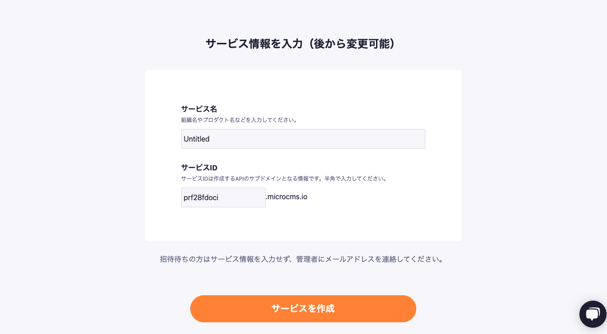
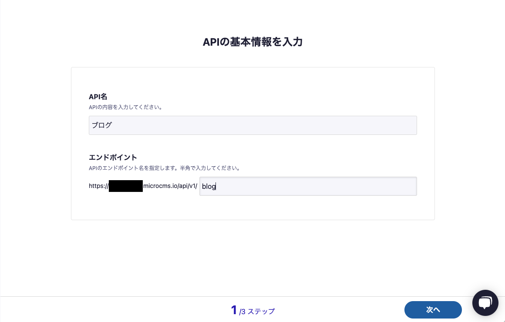
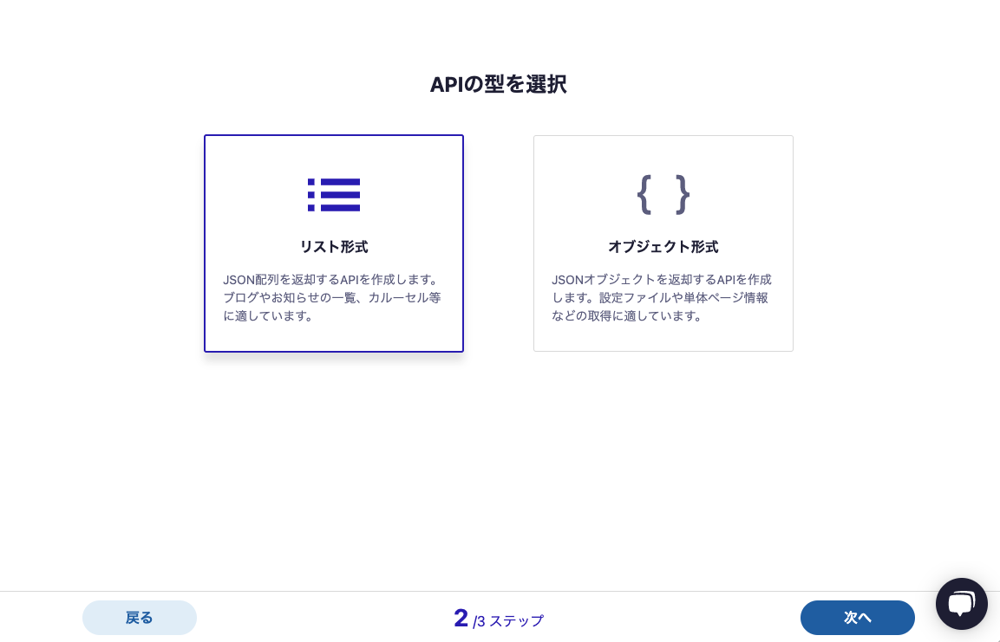
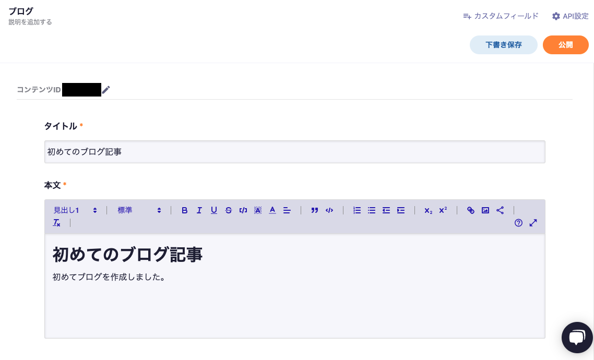
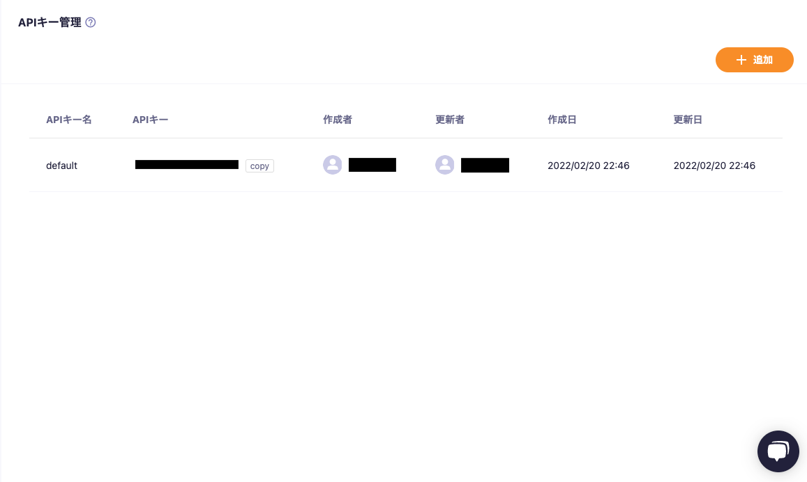

# week6 へ向けた準備

week6 では Next.js と microCMS を使用して個人ブログを 1 人 1 人作成し、それを公開するところまでやってもらいます。ここではその準備を行います。

## microCMS のアカウント作成

**microCMS についてアカウントをすでに所有しており、今回それを使う場合は飛ばしてもらって構いません。**

1. [microCMS](https://microcms.io/)にアクセスして、右上の`新規作成`をクリックする。
2. 登録するアカウントのメールアドレスとパスワードの入力、規約への同意を行いアカウントを作成する
3. サービス名とサービス ID を入力して、サービス情報を登録する(サービス ID は今後変更できない)
   

4. サービス情報を登録すると以下のような画面になるので記載されている URL をクリック
   

5. API 名に API の説明、エンドポイントに`blog`と入力して API 情報を登録する
   

6. API の型の選択で`リスト形式`を選択する
   

7. API スキーマを定義する（特にこだわりがない人は以下の通り `title` と `body` を定義してください）
   

8. コンテンツを作成（とりあえず中身は適当でいいです）
   

## テンプレートのリポジトリをローカルに持ってくる

1. [microcms-blog](https://github.com/sekiyan372/microcms-blog)が今回作成するテンプレートになっているので、ローカルの好きな場所に clone してきます。

```bash
$ git clone https://github.com/sekiyan372/microcms-blog.git
$ cd microcms-blog
```

2. アプリのルートディレクトリに `.env.development.local` ファイルを作成します

```bash
$ touch .env.development.local
```

3. microCMS の管理画面から API キーをコピーする
   

4. 作成した `.env.development.local` をエディタで開いてサービスのドメインと API キーを環境変数として登録する(サービスドメインはサービス ID、管理画面の URL が `https://sample-blog.microcms.io/` なら `sample-blog` の部分)

```
SERVICE_DOMAIN=xxxxxxxxxxxx
API_KEY=xxxxxxxxxxxxx
```

5. packege をインストールする

```bash
$ yarn install
```

6. サーバーを開発環境で起動する(sample の時とコマンドが違うので注意！)

```bash
$ yarn dev
```

7. `localhost:3000` にアクセスして、以下のページが表示されたら OK
   

## 各自の Github にリポジトリを公開

1. 自分の Github アカウントでリポジトリを作成
2. clone したディレクトリで以下を実行

```bash
$ git remote rm origin
$ git remote add origin [リポジトリのurl].git
$ git push -u origin main
```

3. リポジトリにアクセスして push したディレクトリが表示されるかを確認

## Vercel のアカウントを作成

**Vercel についてアカウントをすでに所有しており、今回それを使う場合は飛ばしてもらって構いません。**

1. [Vercel](https://vercel.com/login?next=%2Fdashboard)にアクセス
2. Github アカウントを使ってアカウントを作成する

## Vercel で公開する

1. `New Project` ボタンをクリック
2. Import Git Repository で 自分の Github アカウントが選択されていることを確認して、ブログのリポジトリで `import` をクリック
   

3. PROJECT NAME と FRAMEWORK PRESET を確認する
   

4. `Environment Variables` を開いて `.env.development.local` に設定した環境変数を設定する(名前と値を全く同じに設定してください)
   

5. もう一度内容を確認して、`Deploy` をクリックする
6. エラーが出てなければ公開完了
