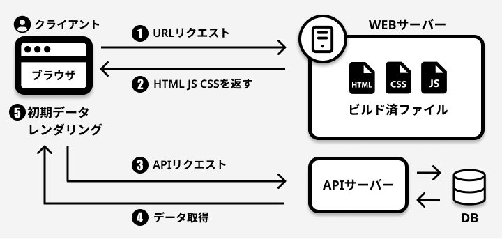
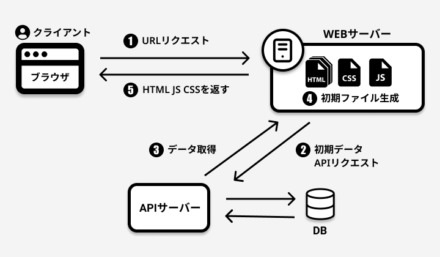
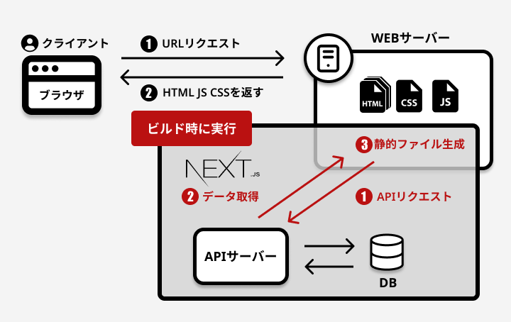
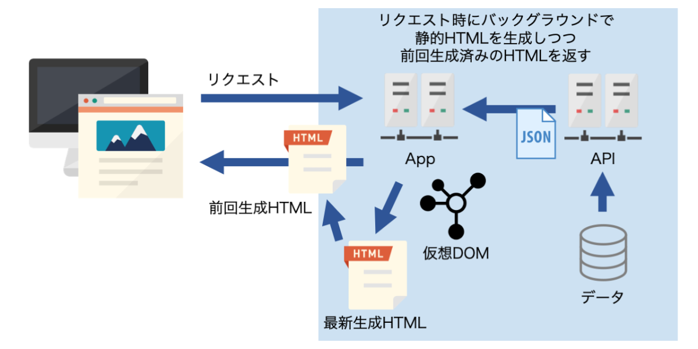

# レンダリング手法

現代のフロントエンドには様々なレンダリングの方法があり、パフォーマンスの観点からサイトの特性に合わせてそれらを使い分けることが求められます。

今回はそれぞれの手法の紹介のみになりますが、フロントエンドエンジニアに興味がある人は今回実装した SPA 以外も自分の手で実装してそれぞれを使いこなせるようになりましょう。

## CSR (Client Side Rendring)

いわゆる以前に説明した SPA のレンダリング手法のことです。

初回のリクエストでほぼ空の HTML ファイルが返されて、その後データを取得してからクライアントサイドでレンダリングします。

### メリット

- 一つの HTML ファイルの中で処理をするためページ遷移がない
- ページ遷移がないので、サーバーへの負荷が少ない

### デメリット

- ページを開いてから HTML の生成を行うため初期描画に時間がかかる (ユーザーのデバイスに依存する)
- 描画の全ての処理がユーザー側で行われるのでユーザーの CPU やメモリを食う
- SEO で不利になることがある

### 適したサービス

- ユーザーがそのサイトに対して滞在時間が長いサービス
- SEO が必要ない管理画面など

## SSR (Server Side Rendering)

CSR のデメリットを解消するために生まれたレンダリング手法で、サーバーサイドで処理を行い HTML ファイルを構築(レンダリング)してからクライアントサイドに返します。初回アクセスはクライアント側から HTTP リクエストが送られて API からデータを取得しサーバー内で HTML ファイルを生成してレンダリング済みの HTML を返します。その後はリクエストが来るたびに動的にその HTML ファイルを生成して返します。
)

### メリット

- 初回アクセス時はクライアント側で API を叩かないので描画が早い
- サーバーサイドでレンダリングまで行うので、ユーザー側の負担が少なく環境にも左右されにくい
- SEO に強くなる

### デメリット

- SSR 用の Node.js が実行できる Web サーバーが必要になる
- サーバー側の負荷が大きくなる
- 秘匿情報が含まれたページが CDN にキャッシュされた場合、個人情報の漏洩などに繋がる可能性がある

### 適したサービス

- コンテンツを頻繁に更新するサービス(SNS など)
- 大規模なサービス

## SSG (Static Site Generator)

アプリケーションのビルド時に API などからデータを取得し、HTML、CSS、JavaScript を最初に生成します。サーバーへリクエストがあった時にこの生成されたファイルを返します。

## メリット

- ビルド時に全てのファイルが生成されるので、SSR よりもレスポンスが高速
- キャッシュを気にする必要がない
- SEO に強い

## デメリット

- ビルド以降、データが更新されてもページに反映されない
- ページの数やコンテンツの数が多くなるとビルド時間が長くなる
- 頻繁にデータ更新があるサイトには向かない

### 適したサービス

- 更新頻度の少ないブログ
- コーポレートサイト

## ISR (Incremental Static Regeneration)

基本的には SSG と同じで初めはビルド時に生成されたものが返されます。ただ、ISR ではその後バックグラウンドで一定期間ごとに静的ページの再生成 (SSR) をサーバー側で行います。まさに、SSR と SSG の間をとったようなレンダリング手法です。

### メリット

- SSG のビルド時間を短縮できる
- SSR と比較すると DB の負荷は軽め

### デメリット

- 現時点では Next.js でしか実装できず、その開発元である Vercel 社へ依存している (Nuxt3 では実装予定らしい)

### 適したサービス

- SSR が必要なほど頻繁な更新はないが、SSG では不十分なぐらいに更新頻度があるサービス

## 参考サイト

それぞれをまとめた記事はたくさんあるので、自分が理解しやすいものを選んで読んでください。

- [Next.js の CSR(SPA),SSR,SSG,ISR のまとめ&メリットデメリットについて](https://tech.012grp.co.jp/entry/2021/03/25/125014)
- [CSR,SSR,SSG,ISR のまとめ](https://qiita.com/souhei-etou/items/4c3320471d23a08510e1)
- [【Next.js】CSR,SSG,SSR,ISR があやふやな人へざっくり解説する](https://zenn.dev/akino/articles/78479998efef55)
- [図解 CSR, SSR, SG(SSG), ISR](https://zenn.dev/bitarts/articles/37260ddb28ae5d)
